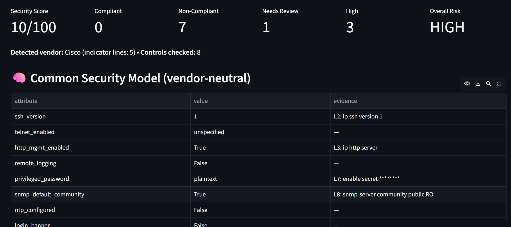
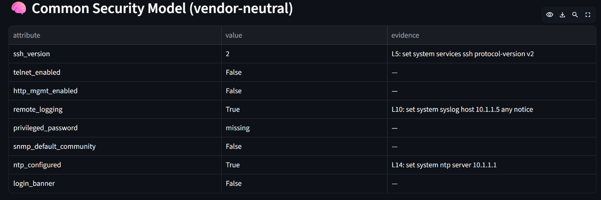
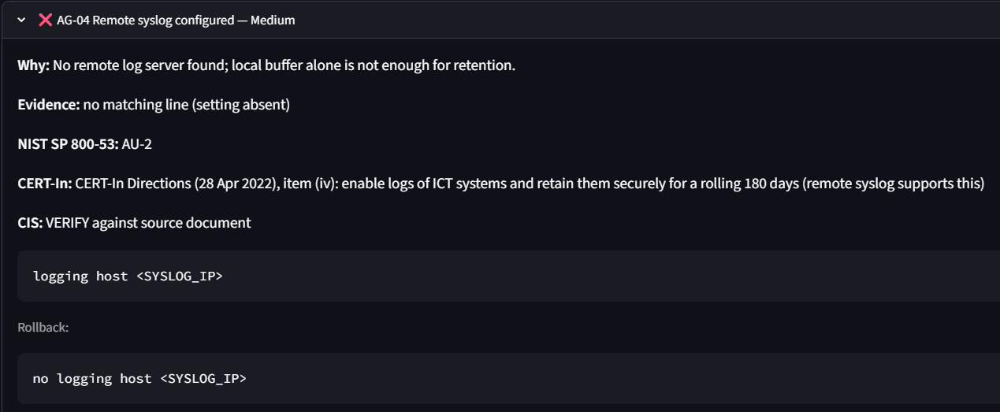

# AegisNet AI

**Unified Multi-Vendor Network Security Compliance Auditor**
Smart India Hackathon 2026 · Problem Statement SIH26155 · Team Ansarash (Team ID 168312)

> Many vendor syntaxes. One security model. One auditable verdict.

**Live prototype:** https://sih26155-network-security-compliance-auditor-aazm9cpldnyz8h97y.streamlit.app/

---

## The problem

Network devices from different vendors describe the same security settings in completely different configuration languages. Auditing a mixed network means learning several syntaxes and checking each device by hand, which is slow, inconsistent and error-prone.

## What AegisNet AI does

1. Accepts a device configuration (upload a file, or paste and edit it in the browser).
2. Detects the vendor and parses it with a vendor-specific adapter (comments are ignored).
3. Converts it into one vendor-neutral **Common Security Model**. Every attribute keeps the exact line number and text it came from.
4. Evaluates the model with a **deterministic rule engine** (no AI in the verdict).
5. Reports findings with evidence, severity, framework references, and a vendor-specific **fix and rollback**.

## Screenshots

### Cisco audit overview



### Juniper configuration in the Common Security Model



### Finding with remediation and rollback



## Status

| | Feature |
|---|---|
| ✅ Implemented | Cisco IOS and Juniper Junos adapters (Junos in both `set` and curly-brace format) |
| ✅ Implemented | Common Security Model with line-level evidence |
| ✅ Implemented | 8 deterministic controls and a severity-weighted score |
| ✅ Implemented | NIST SP 800-53 references; CERT-In Directions (28 April 2022) references for NTP (item i) and log retention (item iv) |
| ✅ Implemented | Vendor-specific fix and rollback commands, remediation script and JSON report download |
| ✅ Implemented | Secrets (passwords) masked in the UI and in reports |
| ✅ Implemented | "Needs Review" state when a config cannot prove a setting (not scored) |
| ✅ Implemented | Live re-audit: edit the config and the score updates |
| ✅ Implemented | Unrecognised vendor stops the audit instead of guessing |
| 🔜 Planned | Fortinet FortiOS and Palo Alto PAN-OS adapters |
| 🔜 Planned | AI-assisted interpretation of unfamiliar syntax, with a confidence score and human review (AI never makes the compliance decision) |
| 🔜 Planned | Firewall rule-base analysis (any-any, shadowed, redundant rules) |
| 🔜 Planned | CIS Benchmark, NCIIPC and RBI mappings |
| 🔜 Planned | Configuration drift tracking, fleet-wide score, PDF and SARIF reports |

## Controls

| ID | Control | Severity | NIST SP 800-53 |
|---|---|---|---|
| AG-01 | SSH version 2 enforced | High | AC-17 |
| AG-02 | Telnet management disabled | High | AC-17, CM-7 |
| AG-03 | HTTP management disabled | Medium | CM-7 |
| AG-04 | Remote syslog configured | Medium | AU-2 (CERT-In item iv) |
| AG-05 | Strong privileged password hashing | High | IA-5 |
| AG-06 | No default SNMP community | High | IA-5 |
| AG-07 | NTP time synchronisation | Low | AU-8 (CERT-In item i) |
| AG-08 | Login banner present | Low | AC-8 |

**Scoring:** start at 100 and subtract 20 for each confirmed High finding, 10 for Medium and 5 for Low. Items marked *Needs Review* are shown but never change the score.

## Try it

Open the live link, choose **Paste / edit config**, and load a sample:

| Sample | Expected score |
|---|---|
| Cisco, weak (`samples/cisco_test.txt`) | 10/100 |
| Cisco, after changing `ip ssh version 1` to `2` | 30/100 (+20) |
| Cisco, hardened (`samples/cisco_hardened.txt`) | 100/100 |
| Juniper, set format (`samples/juniper_set_test.txt`) | 30/100 |
| Juniper, curly-brace (`samples/juniper_curly_test.cfg`) | 75/100 |
| Unrecognised file (`samples/unknown.txt`) | Audit stops with an error |

The passwords in the sample files are fake test values.

## Run locally

```bash
pip install -r requirements.txt
streamlit run app.py
```

## Project structure

```
app.py          Streamlit user interface
adapters.py     Vendor detection and adapters -> Common Security Model
engine.py       Deterministic rules, scoring and remediation
samples/        Test configurations
```

Adding a vendor means writing one parser function in `adapters.py` and registering it in `PARSERS`.

## Design principle

**AI interprets. Deterministic rules decide.** Compliance verdicts are always produced by the rule engine, so results are consistent, explainable and auditable.

## Notes and limits

- Configurations are analysed offline; the tool does not connect to devices.
- Framework mappings show indicative alignment and are **not** a formal certification.
- Review all generated remediation commands before applying them to a production device.

## References

NIST SP 800-53 Rev. 5 · CERT-In Directions of 28 April 2022 (Section 70B(6), IT Act 2000) · Cisco IOS and Juniper Junos documentation. Planned: CIS Benchmarks, NCIIPC guidelines, RBI Cyber Security Framework.
